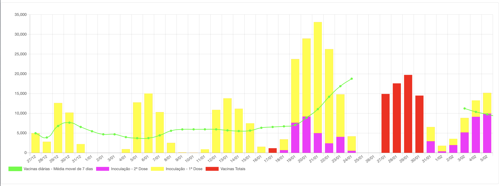

# 🇵🇹💉 Plano de Vacinação - COVID19    [](https://vercel.com/new/git/external?repository-url=https%3A%2F%2Fgithub.com%2Falicescfernandes%2Fmapa-vacinacao-c19)

Este projeto foi desenvolvido com o intuito de mostrar o estado atual do plano de vacinação contra a covid-19. É um trabalho em progresso que vai sofrer atualizações ao longo do tempo, e também recebe os últimos números relacionados com administração das vacinas. 
Todo o código é público, para que seja possível ser adaptado para outras utilizações, e os dados também são atualizados diretamente neste repositório. Para do _dashboard_, é também disponibilizada um [API](https://vacinacaocovid19.pt/api/vaccines) que pode ser consumida por outras aplicações. Se tiveres alguma sugestão de gráficos que sejam pertinentes, podes contribuir diretamente para o código, ou podes enviar sugestões por e-mail.

## Referências
- [Plausible (dados de analytics)](https://plausible.io/vacinacaocovid19.pt)
- [API](https://vacinacaocovid19.pt/api/vaccines)

## Origem dos dados
- [Monitorização do SNS da Direção-Geral da Saúde](https://www.sns.gov.pt/monitorizacao-do-sns/vacinas-covid-19/)  
- [Ponto de Situação Direção-Geral da Saúde](https://covid19.min-saude.pt/ponto-de-situacao-atual-em-portugal/)  
- [Our World of Data](https://github.com/owid/covid-19-data/blob/master/public/data/vaccinations/country_data/Portugal.csv)  

## Embeds
É possivel fazer _embeds_ aos gráficos mostrados no dashboard. Também dá para personalizar as cores dos gráficos
```html
<iframe src="https://vacinacaocovid19.pt/embed/bar?colors=ff00ff&colors=ffff00&colors=ff0000&colors=0000ff&colors=00ff00"/>
```

### Tipos de Embeds
#### Números atuais
```html
<iframe src="https://vacinacaocovid19.pt/embed/counter?colors=ff00ff&colors=ffff00&colors=ff0000&colors=0000ff&colors=00ff00"/>
```
#### Número vacinas administradas
```html
<iframe src="https://vacinacaocovid19.pt/embed/line?colors=ff00ff&colors=ffff00&colors=ff0000&colors=0000ff&colors=00ff00"/>
```
#### Número de vacinas administradas por dia
```html
<iframe src="https://vacinacaocovid19.pt/embed/bar?colors=ff00ff&colors=ffff00&colors=ff0000&colors=0000ff&colors=00ff00"/>
```


## Stack
- ChartJS  
- React  
- NextJS  
- JSON como serviço de dados  
- Vercel  

## Backlog: 
- Carregar nos pontos do gráfico muda o dia 
- Labels todas juntas
- Melhorar experiencia em Mobile
- Minor refactor para contemplar novos gráficos
- ~~Serviço de embeds de gráficos~~  
- Partilhas nas redes sociais de gráficos  

## Backlog - Gráficos
- Vacinas disponíveis (ainda estou tentar arranjar uma maneira fiável de obter estes dados)  
- Fase do Plano de Vacinação
- Notícias (widget de noticias recentes relacionadas com as vacinas)  

 
