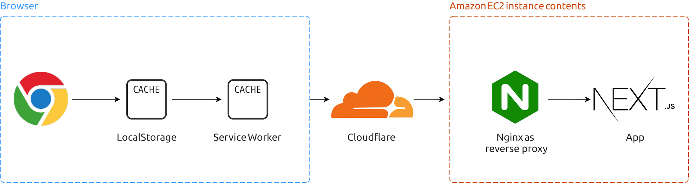

# 🇵🇹💉 Vacinação COVID19 - Dashboard [](https://vercel.com/new/git/external?repository-url=https%3A%2F%2Fgithub.com%2Falicescfernandes%2Fmapa-vacinacao-c19)

[](https://lgtm.com/projects/g/alicescfernandes/mapa-vacinacao-c19/alerts/) [](https://lgtm.com/projects/g/alicescfernandes/mapa-vacinacao-c19/context:javascript)
[](https://github.com/alicescfernandes/mapa-vacinacao-c19/actions)

Este projeto foi desenvolvido com o intuito de mostrar o estado atual do plano de vacinação contra a covid-19. É um trabalho em progresso que vai sofrer atualizações ao longo do tempo, e também recebe os últimos números relacionados com administração das vacinas. 
Todo o código é público (incluindo também os desenhos originais do site), para que seja possível ser adaptado para outras utilizações, e os dados também são atualizados diretamente neste repositório. Para do _dashboard_, é também disponibilizada um [API](https://vacinacaocovid19.pt/api/vaccines) que pode ser consumida por outras aplicações. Se tiveres alguma sugestão de gráficos que sejam pertinentes, podes contribuir diretamente para o código, ou podes enviar sugestões por e-mail.  
## Referências
- [Plausible (dados de analytics)](https://plausible.io/vacinacaocovid19.pt)
- [API](https://vacinacaocovid19.pt/api/vaccines)

## Origem dos dados
Ver [SOURCES.MD](/_readme/SOURCES.md)
## Stack



- ChartJS  
- React  
- NextJS  
- Pusher para sockets
- Firebase Cloud Messaging + Web Push API para notificações (incluindo notificações com o site desligado)
- MongoDB para gerir tokens de notificações
- JSON como serviço de dados  
- Github Actions para CI
- Github Hooks (para lançar um novo deploy)
- ~~Vercel~~ Já não estamos na Vercel!
- Cloudflare


## Fazer setup local (com docker)
```bash 
git clone https://github.com/alicescfernandes/mapa-vacinacao-c19/ 
docker build -t vacinacaocovid19 .
docker run -d -p 80:3000 -P --name vacinacaocovid19 vacinacaocovid19 # site em localhost:80
```
## Fazer setup local (sem docker)
## Criar `.env`
Ver [SETUP.MD](/_readme/SETUP.md)
### Instalar dependencias
```bash
pip3 install -r requirements.txt

# JS
npm install
# ou
yarn
```
### Instalar comandos globais (fazer os symlinks)
```bash
npm link # ou sudo npm link
daemon_data # comando para fazer update aos dados
```
### Correr projeto
```bash
npm run start
# ou
yarn start # abre no localhost:3000
```

## Lançar o scrapper bot _OPCIONAL_
Os dados são scrappados com um cron job que vai às fontes, retira o JSON e atualiza o respositório ao código.  
Existem duas maneiras de lançar o _scrapper_ bot: através de um `screen` ou pelo o `pm2`


- Screen
```bash
sudo apt install screen
# este comando vai correr o daemon_data num screen chamado daemon.
# -S daemon [nome], -d -> detached mode, -m -> abrir sempre uma nova janela; -dm -> abrir uma nova janela em detached mode 
screen -S daemon -dm bash -c "daemon_data; exec bash" 

screen -S daemon -X quit # para terminar o screen chamado daemon
screen -r daemon  # entrar dentro do screen chamado daemon. Para sair é pressionar CTRL+A e depois D
```

- PM2
```bash
npm install -g pm2
pm2 start daemon_data --name "daemon" # lançar o processo
pm2 restart daemon # restart do processo
pm2 stop daemon # parar o processo
pm2 logs daemon # Ler logs do processo
pm2 list # Ver todos os processos geridos pelo pm2
pm2 monit # Ver status de todos os processos geridos pelo pm2
```


